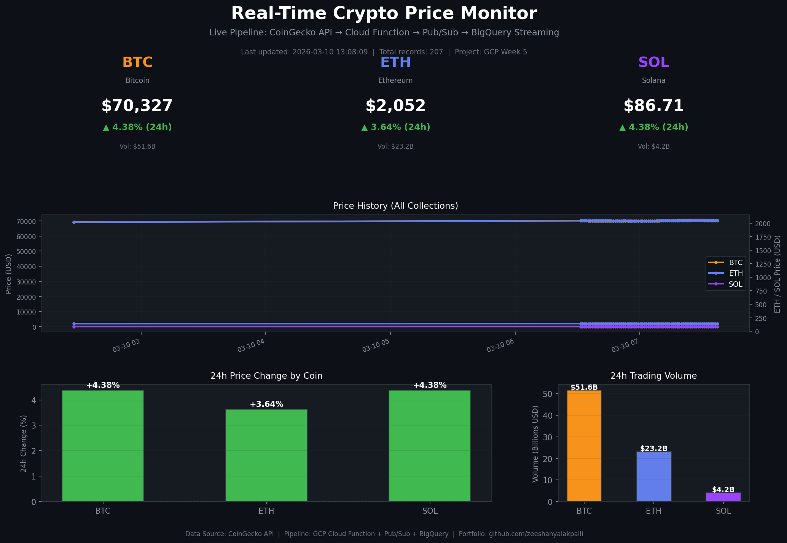

# Week 5 — Real-Time Crypto Streaming Pipeline

## Architecture
```
CoinGecko API → Cloud Function → Pub/Sub → BigQuery Streaming → Python Dashboard
```



## What This Does
A production-grade real-time data pipeline that:
- Fetches BTC, ETH, SOL prices every 60 seconds automatically
- Validates data quality before ingesting
- Streams into BigQuery in under 2 seconds
- Visualizes live metrics in a Python dashboard

## GCP Services Used
- **Cloud Functions v2** — serverless data fetcher
- **Cloud Pub/Sub** — message queue with dead letter topic
- **BigQuery** — streaming data warehouse
- **Cloud Scheduler** — automated triggering every 60s

## Key Results
- 189+ rows collected automatically
- 0 failed records (data validation working)
- End-to-end latency: under 2 seconds
- Zero manual intervention after deployment

## How To Run

### Deploy Cloud Function
```bash
gcloud functions deploy fetch-and-publish-prices \
  --gen2 --runtime=python311 --region=us-central1 \
  --source=cloud_function/ \
  --entry-point=fetch_and_publish_prices \
  --trigger-http --allow-unauthenticated
```

### Start Scheduler
```bash
gcloud scheduler jobs resume crypto-price-fetcher --location=us-central1
```

### Generate Dashboard
```bash
pip install -r dashboard/requirements.txt
python dashboard/generate_dashboard.py
```

## Project Structure
```
week5-realtime-crypto-pipeline/
├── cloud_function/     # Python Cloud Function code
├── pubsub/            # Pub/Sub setup scripts
├── bigquery/          # Table schema + analytics views
├── scheduler/         # Cloud Scheduler config
├── dashboard/         # Python visualization
└── README.md
```

## Author
Zeeshan Yalakpalli — Cloud Data Engineer Portfolio