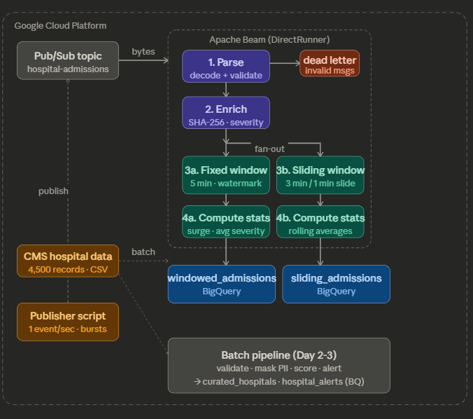

# Week 6 — Hospital Operations Pipeline
### Apache Beam · GCP Dataflow · Pub/Sub · BigQuery · Docker

> **90-Day Cloud Data Engineering Portfolio** | Week 6 of 13

---

## What this project does

A real-time hospital operations pipeline that ingests live admission events from Google Pub/Sub, processes them using Apache Beam, detects patient surges using windowed aggregations, and writes results to BigQuery — all running inside Docker.

**Two pipelines in one project:**
- **Batch pipeline** — processes 4,500 US hospital records from CMS data (validate → mask PII → enrich → detect anomalies → BigQuery)
- **Streaming pipeline** — ingests live admission events at 1 event/sec, applies fixed + sliding windows, detects surge conditions in real time

---

## Architecture

## Architecture



```
Publisher script (1 event/sec)
        ↓
  GCP Pub/Sub (hospital-admissions topic)
        ↓
  ┌─────────────────────────────────────────┐
  │         Apache Beam Pipeline            │
  │                                         │
  │  1. Parse     → dead letter (invalid)   │
  │  2. Enrich    → SHA-256 PII masking     │
  │       ↓              ↓                  │
  │  3a. Fixed Windows   3b. Sliding Windows│
  │      (5 min)             (3 min/1 min)  │
  │  4a. Compute stats   4b. Compute stats  │
  └──────────┬───────────────────┬──────────┘
             ↓                   ↓
   windowed_admissions    sliding_admissions
        (BigQuery)             (BigQuery)
```

---

## Tech Stack

| Tool | Purpose |
|------|---------|
| Apache Beam 2.61 | Pipeline framework (batch + streaming) |
| GCP Pub/Sub | Message broker for streaming events |
| GCP Dataflow | Cloud runner (target — local DirectRunner used due to zone exhaustion) |
| BigQuery | Output sink for windowed stats |
| Docker | Python 3.11 environment (local Python 3.13 incompatible with Beam) |
| GCS | Staging + temp for Dataflow |

---

## Project Structure

```
week6-dataflow-beam/
├── docker/
│   ├── Dockerfile                  # apache/beam_python3.11_sdk:2.61.0 base
│   └── docker-compose.yml
├── data/
│   └── hospitals_raw.csv           # 4,500 CMS hospital records
├── local_pipelines/
│   └── hospital_batch_pipeline.py  # Day 2: local batch (DirectRunner)
├── dataflow_batch/
│   └── hospital_dataflow_pipeline.py  # Day 3: Dataflow batch
├── dataflow_streaming/
│   └── hospital_streaming_pipeline.py # Days 4-6: streaming + BQ sink
├── scripts/
│   ├── publish_admissions.py       # Pub/Sub event publisher
│   └── generate_synthetic_data.py
├── output/results/                 # Local batch output (.jsonl)
└── requirements.txt
```

---

## Day-by-Day Breakdown

### Day 1 — Environment Setup
- Docker setup with `apache/beam_python3.11_sdk:2.61.0` (Python 3.13 incompatible with Beam)
- GCS bucket, BigQuery dataset creation
- CMS hospital data loaded to GCS

### Day 2 — Local Batch Pipeline ✅
- 5-stage pipeline: Parse → Validate → Mask PII → Enrich → Detect anomalies
- `TaggedOutput` for dead-letter routing (invalid records)
- SHA-256 salted hashing for facility ID masking (HIPAA pattern)
- Quality tier scoring (A–F) + risk score (0–100)
- **Result:** 4,235 curated + 265 alerts written to `.jsonl`

### Day 3 — GCP Dataflow Batch ✅ (code complete)
- Same pipeline deployed to Dataflow with `DataflowRunner`
- GCS staging/temp configured, BigQuery sinks added
- **Blocker:** `ZONE_RESOURCE_POOL_EXHAUSTED` in us-central1 and us-west1
- Job graph visible in Dataflow console, workers never provisioned

### Day 4 — Streaming Pipeline ✅
- `ReadFromPubSub` subscription-based ingestion
- Publisher script: 1 event/sec, 5 hospitals, shift-change bursts every 20 events
- 5-minute `FixedWindows` with `GroupByKey` per hospital
- `ComputeWindowStats` DoFn: admission count, critical/high counts, surge detection
- **Result:** Window summaries printing every 5 minutes via DirectRunner

### Day 5 — Watermarks + Sliding Windows ✅
- `AfterWatermark(late=AfterCount(1))` trigger on FixedWindows
- `allowed_lateness=120s` — accept events up to 2 min late (ambulance/network delay)
- `AccumulationMode.ACCUMULATING` — late events update existing window totals
- `SlidingWindows(3*60, 1*60)` — rolling 3-minute view updated every minute
- **Result:** Both `[FIXED WINDOW]` and `[SLIDING]` output confirmed, SURGE detection working

### Day 6 — BigQuery Sink ✅
- `WriteToBigQuery` with `WRITE_APPEND` + `CREATE_NEVER`
- Timestamp formatted as `"YYYY-MM-DD HH:MM:SS UTC"` for BQ compatibility
- Two tables populated: `windowed_admissions` + `sliding_admissions`
- **Result:** All 5 hospitals writing to BQ, `is_surge: true` confirmed via `bq query`

---

## Key Concepts Demonstrated

**PII Masking**
```python
masked_id = hashlib.sha256(
    f"salt_zeeshan_{raw_patient_id}".encode()
).hexdigest()[:10].upper()
```

**Watermark + Allowed Lateness**
```python
beam.WindowInto(
    FixedWindows(5 * 60),
    trigger=AfterWatermark(late=AfterCount(1)),
    allowed_lateness=2 * 60,
    accumulation_mode=AccumulationMode.ACCUMULATING,
)
```

**Sliding Windows**
```python
beam.WindowInto(SlidingWindows(3 * 60, 1 * 60))
# 3-min window, slides every 1 min → rolling dashboard view
```

---

## Running Locally

**Prerequisites:** Docker Desktop, gcloud authenticated, GCP project with Pub/Sub + BigQuery enabled

```bash
# Navigate to project
cd projects/week6-dataflow-beam

# Build Docker image
docker build -t beam-hospital-pipeline -f docker/Dockerfile .

# Terminal 1 — Run pipeline
docker run --rm \
  -e GOOGLE_APPLICATION_CREDENTIALS=/tmp/gcp_key.json \
  -v "$HOME/AppData/Roaming/gcloud/application_default_credentials.json:/tmp/gcp_key.json" \
  --entrypoint python beam-hospital-pipeline \
  dataflow_streaming/hospital_streaming_pipeline.py

# Terminal 2 — Publish events
docker run --rm \
  -e GOOGLE_APPLICATION_CREDENTIALS=/tmp/gcp_key.json \
  -v "$HOME/AppData/Roaming/gcloud/application_default_credentials.json:/tmp/gcp_key.json" \
  --entrypoint python beam-hospital-pipeline \
  scripts/publish_admissions.py
```

**Query results:**
```sql
SELECT hospital_name, window_start, window_end, total_admissions, is_surge
FROM hospital_streaming.windowed_admissions
ORDER BY window_start
LIMIT 20
```

---

## Sample Output

```
====================================================
  [FIXED WINDOW] General Hospital NY
  Period  : 2026-03-13 15:05:00 -> 2026-03-13 15:10:00
  Total   : 29 admissions
  Critical: 1 | High: 5
  Avg Sev : 1.72 | *** SURGE DETECTED ***
  → Written to BQ: hospital_streaming.windowed_admissions
====================================================

  [SLIDING] University Hospital IL    | 15:06->15:09 |  28 admissions | avg sev: 1.82 <-- SURGE
  [SLIDING] General Hospital NY       | 15:06->15:09 |  29 admissions | avg sev: 1.72 <-- SURGE
```

---

## GCP Resources Used

| Resource | Name |
|----------|------|
| GCS Bucket | `zeeshan-hospital-pipeline` |
| Pub/Sub Topic | `hospital-admissions` |
| Pub/Sub Subscription | `hospital-admissions-sub` |
| BQ Dataset (streaming) | `hospital_streaming` |
| BQ Dataset (batch) | `hospital_analytics` |
| Region | `us-west1` |

---

## What I Learned

1. **Streaming requires a different mental model** — data never stops, you compute over windows not files
2. **Watermarks solve the late data problem** — Beam's clock for deciding when a window is "done"
3. **DirectRunner vs DataflowRunner** — same code, different execution environments
4. **Docker as environment isolation** — Python 3.13 incompatible with Beam, Docker pins Python 3.11
5. **BigQuery timestamp format** — must be `"YYYY-MM-DD HH:MM:SS UTC"` not `.isoformat()`

---

*Part of a 90-day cloud data engineering learning journey.*
*Week 5: Real-time crypto pipeline (Pub/Sub + Cloud Functions + BigQuery)*
*Week 7: Coming soon*