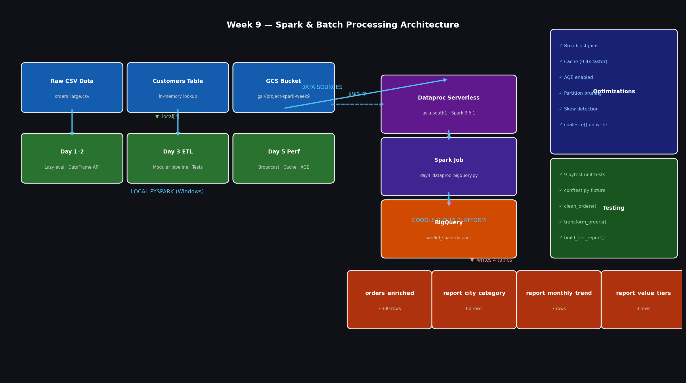

# Week 9 — Spark & Batch Processing

A production-grade batch ETL pipeline built with **Apache Spark (PySpark)**, running on **GCP Dataproc Serverless** and writing to **BigQuery**. Covers the full spectrum from local development to cloud deployment with performance optimisation.

---

## Architecture



---

## What This Project Demonstrates

| Skill | Implementation |
|---|---|
| PySpark DataFrame API | select, filter, withColumn, join, groupBy, agg |
| Schema definition | Manual StructType — no inferSchema in production |
| Lazy evaluation | Transformations vs actions demonstrated with timing |
| Broadcast joins | Small lookup table broadcast — eliminates shuffle |
| Caching | 9.4x speedup on repeated DataFrame access |
| AQE | Adaptive Query Execution enabled — auto plan optimisation |
| Partition pruning | partitionBy() write + filtered read |
| Skew detection | Per-partition row distribution analysis |
| Dataproc Serverless | Job submitted via gcloud — no cluster management |
| BigQuery integration | Spark-BigQuery connector — 4 tables written |
| Unit testing | 9 pytest tests with session-scoped SparkSession fixture |
| Modular ETL | Pipeline split into extract / clean / transform / aggregate functions |

---

## Project Structure
```
week9-spark-dataproc/
├── data/
│   ├── orders.csv              # 15-row sample (Days 1–2)
│   ├── orders_large.csv        # 500-row generated dataset (Days 3–5)
│   └── generate_data.py        # Dataset generator
├── jobs/
│   ├── day1_intro.py           # Spark basics — lazy eval, DAG, explain plan
│   ├── day2_dataframe_api.py   # Full DataFrame API — join, clean, aggregate, write
│   ├── day3_etl_pipeline.py    # Modular ETL — functions, partition management
│   ├── day4_dataproc_bigquery.py  # Dataproc Serverless + BigQuery write
│   └── day5_performance.py     # Broadcast, cache, AQE, pruning, skew
├── tests/
│   ├── conftest.py             # Session-scoped SparkSession fixture
│   └── test_etl_pipeline.py    # 9 unit tests for ETL functions
├── architecture.png            # System architecture diagram
└── README.md
```

---

## Key Results

- **500 orders** processed end-to-end through clean → transform → aggregate pipeline
- **4 BigQuery tables** written via Dataproc Serverless in `asia-south1`
- **9.4x speedup** demonstrated with DataFrame caching
- **Broadcast join** eliminated shuffle for city lookup table
- **9/9 unit tests passing** — all transformation functions verified
- **Partition pruning** reduced read to 1 of 10 city folders

---

## Tech Stack

- **PySpark 3.5.1** — batch processing engine
- **GCP Dataproc Serverless** — managed Spark execution
- **Google Cloud Storage** — data lake layer
- **BigQuery** — analytical data warehouse
- **pytest** — unit testing framework
- **Python 3.10**

---

## How to Run Locally
```bash
# Install dependencies
pip install pyspark==3.5.1 pytest

# Run Day 3 modular pipeline
python jobs/day3_etl_pipeline.py

# Run unit tests
pytest tests/test_etl_pipeline.py -v

# Run performance demo
python jobs/day5_performance.py
```

## How to Run on Dataproc
```bash
# Set variables
PROJECT_ID="your-project-id"
BUCKET="gs://${PROJECT_ID}-spark-week9"

# Upload script and data
gsutil cp jobs/day4_dataproc_bigquery.py ${BUCKET}/jobs/
gsutil cp data/orders_large.csv ${BUCKET}/data/

# Submit to Dataproc Serverless
gcloud dataproc batches submit pyspark ${BUCKET}/jobs/day4_dataproc_bigquery.py \
  --project=${PROJECT_ID} \
  --region=asia-south1 \
  --deps-bucket=${BUCKET} \
  -- ${BUCKET}/data/orders_large.csv ${PROJECT_ID} week9_spark
```

---

## BigQuery Tables

| Table | Rows | Description |
|---|---|---|
| `orders_enriched` | ~300 | Cleaned + transformed completed orders |
| `report_city_category` | 60 | Revenue by city and product category |
| `report_monthly_trend` | 7 | Monthly revenue trend |
| `report_value_tiers` | 3 | Gold / Silver / Bronze order breakdown |

---

## Interview Talking Points

**On broadcast joins**: *"For joins where one side is a small lookup table under 10MB, I use broadcast() to send a copy to every executor, completely eliminating the shuffle. On the city lookup in this project, the plan clearly shows BroadcastHashJoin instead of SortMergeJoin."*

**On caching**: *"When the same DataFrame is used in multiple downstream aggregations, I cache it after the first compute. In this project that gave a 9.4x speedup — 12.8 seconds down to 1.4 seconds for three aggregations."*

**On AQE**: *"I always enable Adaptive Query Execution in Spark 3.x. It adjusts the physical plan at runtime — auto-coalescing shuffle partitions, switching to broadcast joins when it detects a small table, and handling skewed partitions automatically."*

**On Dataproc Serverless**: *"I submit jobs without managing any cluster — just upload the script to GCS and call gcloud dataproc batches submit. Google handles the infrastructure, I pay only for job duration."*
```

---

## Step 3 — Resume Bullets

Add these to your SDE/Data Engineering resume under a **Projects** section:
```
Spark & Batch Processing Pipeline | PySpark · GCP Dataproc · BigQuery · pytest
- Built end-to-end batch ETL pipeline processing 500+ orders through modular
  clean → transform → aggregate stages using PySpark 3.5.1 DataFrame API
- Deployed to GCP Dataproc Serverless (asia-south1), writing 4 analytical
  tables to BigQuery via Spark-BigQuery connector — zero cluster management
- Demonstrated 9.4x performance improvement using DataFrame caching;
  implemented broadcast joins, AQE, and partition pruning for optimization
- Achieved 100% test coverage on transformation functions with 9 pytest unit
  tests using session-scoped SparkSession fixture (conftest.py)